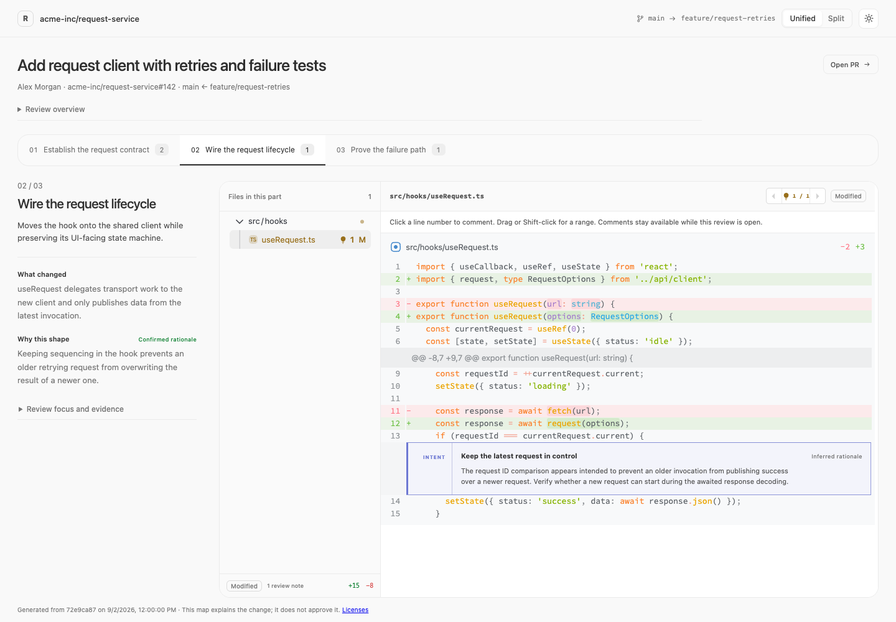

# Visualize PR

Turn a pull request into an interactive review map, grouped by what the change does. Each part explains what changed, why the implementation takes that shape, and what a reviewer should verify beside the relevant diffs.

## Install the skill

Install with the Skills CLI:

```bash
npx skills add eden-lane/visualize-pr --skill visualize-pr
```

To install from a local checkout, run:

```bash
npx skills add . --skill visualize-pr
```

Alternatively, copy `skills/visualize-pr/` directly into your agent's skills directory. The Skills CLI is an optional installation method, not a dependency of the generator. Codex display metadata is included; the core instructions follow the Agent Skills format.

A prebuilt generator turns review JSON into a standalone local executable. **Generating and opening reviews requires no Bun, Node.js, Python, package manager, or `node_modules` installation.**

<picture>
  <source media="(prefers-color-scheme: dark)" srcset="docs/preview-dark.png">
  
</picture>

## Features

- Tabbed change sets: one active review section, with keyboard navigation and direct links.
- A compact explanation column beside an editor frame combining the file tree and exact diff fragments.
- Evidence-backed explanations, with inferred and unknown rationale labeled.
- Generated inline review notes with previous/next navigation.
- Add, edit, and delete your own comments on a code line or range; copy all comments as instructions for an agent, including paths and old/new line coordinates.
- Unified and split diffs, local Hasklig fonts, and Ayu syntax themes.
- Automatic light/dark mode that follows the browser preference; manual switching lasts until reload.
- A responsive layout with independently scrolling descriptions, file trees, and diffs; file selection is remembered per tab.
- A local server bound to `127.0.0.1`, with a free port selected automatically.

This is an aid to review, not a correctness or security verdict. Generated executables contain the supplied PR code and explanations; share them with the same care as the source repository.

Click a diff line number to add a comment. Drag across line numbers or Shift-click another number to select an inclusive range on the same diff side. Saved comments have Edit and Delete controls. Once a comment exists, the floating **Copy instructions for agent** button copies all your comments across files and tabs. Comments remain available while the page is open; reloading or closing it clears them. Generated notes are not included in the copied instructions.

## Use

Ask your agent:

```text
Use $visualize-pr to walk me through https://github.com/OWNER/REPOSITORY/pull/123.
```

The agent collects PR evidence, groups the patch, writes review JSON, and invokes the prebuilt generator. It reads the source PR without modifying it.

The launcher automatically fetches the pinned native binary on first use and checks its SHA-256 checksum. Downloads use the system shell, curl, and checksum tools. Later runs use the cached binary. It does not install a language runtime or application dependencies. macOS uses its system `codesign` tool to sign the generated executable.

To use the launcher directly:

```bash
skills/visualize-pr/scripts/visualize-pr \
  --data /absolute/path/to/review.json \
  --output /absolute/path/to/pr-review-map
/absolute/path/to/pr-review-map
```

Open the printed URL. `PORT` optionally selects a port. The output embeds its review data, renderer, fonts, notices, and runtime: it can run independently after deleting the input JSON and generator. Existing output files are never overwritten.

Release builds cover macOS and Linux on arm64 and x64. Each generator produces executables for its own OS and architecture. Binaries are distributed through GitHub release assets, rather than stored in Git. This unpublished checkout uses a locally built generator until a release is available.

## Maintainer development

Only maintainers need Bun. The validated version is **1.4.0**. Dependencies are locked in `bun.lock` and remain local to the source checkout.

```bash
cd skills/visualize-pr/assets/review-app
bun install --frozen-lockfile
cd ../../../..
bun scripts/check.ts
```

The check validates skill metadata, local references, review data, and TypeScript; builds the generator; and runs it with no runtimes on `PATH`. It then removes the generator and input JSON and tests the resulting executable from a directory containing only that executable.

To build without the checks:

```bash
bun scripts/build.ts
```

The result is `dist/visualize-pr-<os>-<arch>` plus its `.sha256` file. To exercise it with the synthetic example:

```bash
dist/visualize-pr-darwin-arm64 \
  --data skills/visualize-pr/assets/review-app/src/review-data.json \
  --output work/demo-review
work/demo-review
```

Use the matching binary name for your platform. To test the skill launcher before publication, place that binary in `skills/visualize-pr/bin/v0.1.0/` with the same filename; this cache is ignored by Git. Browser validation should cover file selection, inline notes, comment creation/editing/deletion, range selection, copied instructions, both diff layouts, narrow screens, and automatic and manual theme changes.

## Repository layout

```text
skills/visualize-pr/   Installable instructions, launcher, references, and app source
src/                  Generator and review-data validator
scripts/              Maintainer build and isolated runtime checks
tests/                Review-data validation regressions
.github/workflows/    Validation and manual native binary builds
docs/PUBLISHING.md     Steps for publishing when ready
```

The repository is the source for future development. An existing separately installed copy is not automatically updated when this checkout changes.

## Publish

See [the publishing guide](docs/PUBLISHING.md). Configure the release source, build the native binaries, publish a GitHub release when authorized, then distribute the skill through skills.sh. No npm release or custom marketplace manifest is needed.

## License

[MIT](LICENSE). The bundled Hasklig fonts retain their [SIL Open Font License](skills/visualize-pr/assets/review-app/src/fonts/OFL.txt). See [third-party notices](skills/visualize-pr/THIRD_PARTY_NOTICES.md). Generated reviews expose their embedded notices at `/licenses.txt`.
